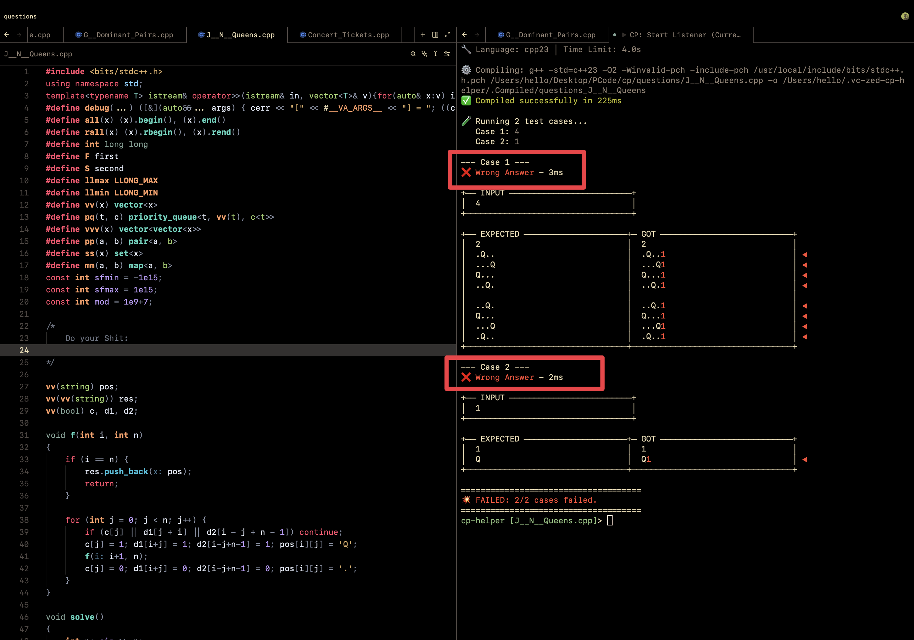

<div align="center">
  <h1>🚀 Zed CP Helper</h1>
  <p><strong>A fully automated, zero-latency background tool for competitive programming in the <a href="https://zed.dev/">Zed</a> editor on macOS.</strong></p>

  [](#)
  [](#)
  [](#)
  [](#)
</div>

<br>

This tool runs entirely locally as a lightweight Python script. It intercepts problem data from the [Competitive Companion](https://github.com/jmerle/competitive-companion) browser extension, auto-creates your source files with a problem-specific template and test cases, allows you to instantly compile and run tests directly in Zed, and fully automates **zero-click submissions** to Codeforces and AtCoder using Safari.

---

## ✨ Features

* 📥 **Auto-Parses Problems**: Instantly captures problem requirements, constraints, and sample test cases via Competitive Companion.
* 🏗️ **Smart Boilerplate Injection**: Injects your C++ template cleanly. No messy test case comments in your code; test cases are safely stored in a hidden `.testcases/` database.
* 🚀 **Blazing Fast Test Execution**: Compiles and runs all sample and custom test cases locally with precise execution-time tracking.
* 🤖 **Zero-Click Submissions**: Submits directly to Codeforces and AtCoder in the background by automating Safari (no manual uploading!).
* 📁 **Live Directory Switching**: Change where new problems are saved at runtime using `cd <path>` and check it with `pwd` (no listener restart needed).
* ⌨️ **Readline Autocompletion**: The built-in REPL supports command completion and directory path completion.
* 📡 **Live Verdict Polling**: Shows live Codeforces status (In queue, Judging, AC, WA) directly in your terminal without looking at the browser.
* 📊 **Side-by-Side Diff Cards**: Formats wrong answers in elegant side-by-side expected vs. actual tables with character-level highlights.
* 🧱 **Zero Sandboxing Limits**: Standard Zed CP extensions suffer from WASM/network limits. This native approach has zero limits.

---

## 📋 Prerequisites

- **macOS** *(Relies on native Apple Events for Safari automation)*
- **Python 3.8+**
- **Safari** with **"Allow JavaScript from Apple Events"** enabled:
  - `Safari` → `Preferences` → `Advanced` → Check `"Show Develop menu"`
  - `Develop` → `Allow JavaScript from Apple Events`
- **[Zed Code Editor](https://zed.dev/)**
- **C++ Compiler** (e.g., `g++` via Homebrew or Apple Clang)
- **[Competitive Companion](https://github.com/jmerle/competitive-companion)** browser extension.

> **💡 Why Safari Only?**
> Submission automation requires the browser to run JavaScript in the background without bringing the window to the foreground. **Only Safari supports this** natively via AppleScript. Other browsers interrupt your workflow by forcing the window to the foreground.

---

## 🛠️ Installation

### 1. Clone the Repository
By default (and highly recommended), the script and its configurations live in `~/.vc-zed-cp-helper/`.

```bash
cd ~ && git clone https://github.com/prsweet/vc-zed-cp-helper.git .vc-zed-cp-helper
```
*(Note: To use a custom folder, edit the `APP_DIR` variable at the top of `main.py`.)*

### 2. Add Custom Code Template (Optional)
Drop your default template inside the app directory at `~/.vc-zed-cp-helper/`:
- **C++** → `boilerplate.cpp`
- **Python** → `boilerplate.py`
- **Java** → `boilerplate.java`

### 3. Setup Zed Tasks
Open your Zed tasks file (`~/.config/zed/tasks.json`) and append these tasks to integrate seamlessly with Zed's task runner (`cmd+shift+R`):

<details>
<summary><strong>Click to view the <code>tasks.json</code> configuration</strong></summary>

```json
[
  {
    "label": "CP: Start Listener (Current Folder)",
    "command": "python3 ~/.vc-zed-cp-helper/main.py listen",
    "use_new_terminal": true,
    "allow_concurrent_runs": false,
    "hide": "never",
    "reveal_target": "center"
  },
  {
    "label": "CP: Run Tests",
    "command": "python3 ~/.vc-zed-cp-helper/main.py send_repl r \"${ZED_FILE}\"",
    "use_new_terminal": false,
    "allow_concurrent_runs": false,
    "reveal": "never",
    "hide": "always"
  },
  {
    "label": "CP: Submit to Codeforces / AtCoder",
    "command": "python3 ~/.vc-zed-cp-helper/main.py submit \"${ZED_FILE}\"",
    "use_new_terminal": true,
    "allow_concurrent_runs": true,
    "reveal": "always"
  },
  {
    "label": "CP: Set Language [cpp23]",
    "command": "python3 ~/.vc-zed-cp-helper/main.py set_lang cpp23",
    "use_new_terminal": false,
    "allow_concurrent_runs": false
  },
  {
    "label": "CP: Set Template [boilerplate]",
    "command": "python3 ~/.vc-zed-cp-helper/main.py set_template boilerplate",
    "use_new_terminal": false,
    "allow_concurrent_runs": false
  },
  {
    "label": "CP: Status",
    "command": "python3 ~/.vc-zed-cp-helper/main.py status",
    "use_new_terminal": false,
    "allow_concurrent_runs": false
  },
  {
    "label": "CP: Add Custom Test Case",
    "command": "python3 ~/.vc-zed-cp-helper/main.py send_repl a \"${ZED_FILE}\"",
    "use_new_terminal": false,
    "allow_concurrent_runs": false,
    "reveal": "never",
    "hide": "always"
  },
  {
    "label": "CP: Edit Test Cases",
    "command": "python3 ~/.vc-zed-cp-helper/main.py send_repl e \"${ZED_FILE}\"",
    "use_new_terminal": false,
    "allow_concurrent_runs": false,
    "reveal": "never",
    "hide": "always"
  },
  {
    "label": "CP: Sync boilerplate snippet",
    "command": "python3 ~/.vc-zed-cp-helper/sync_boilerplate_snippet.py",
    "use_new_terminal": false,
    "allow_concurrent_runs": false,
    "reveal": "always"
  }
]
```
</details>

### 4. Optimize Your Keymap
Add these to your user keymap file (`~/.config/zed/keymap.json`) for lightning-fast shortcuts:

```json
[
  {
    "context": "Editor",
    "bindings": {
      "cmd-'": ["task::Spawn", { "task_name": "CP: Run Tests" }],
      "cmd-enter": ["task::Spawn", { "task_name": "CP: Submit to Codeforces / AtCoder" }],
      "cmd-r": ["workspace::SendKeystrokes", "cmd-alt-shift-r cmd-\\"],
      "cmd-alt-a": ["workspace::SendKeystrokes", "cmd-k cmd-right a enter"],
      "cmd-alt-e": ["task::Spawn", { "task_name": "CP: Edit Test Cases" }]
    }
  },
  {
    "context": "Workspace",
    "bindings": {
      "cmd-alt-shift-r": ["task::Spawn", { "task_name": "CP: Start Listener (Current Folder)" }]
    }
  }
]
```

---

## 🎮 Usage Guide

### 1. Start the Listener
At the start of your session, press **`cmd-r`**.
* This launches the unified REPL shell. Drag this tab to the right side of the screen for a perfect split-editor layout.
* Click the green `+` on the **Competitive Companion** extension in your browser.
* Zed will automatically create a clean `.cpp` file and append it to your active workspace window.

### 2. Configure Once
* **Set Language:** Run the **CP: Set Language [cpp23]** task. Every "Run" or "Submit" task will now default to this. *(Use TAB to swap `cpp23` for `python`, `java`, etc.)*
* **Set Template:** If you prefer Zed snippets over `boilerplate.cpp`, run **CP: Set Template [boilerplate]**.

### 3. Test & Submit
* **Test (`cmd-'`):** Runs tests directly in your active REPL pane on the right.
* **Submit (`cmd-enter`):** Spawns a background task tracking the live verdict (`WJ` ➔ `Judging` ➔ `✅ ACCEPTED`).

---

## ⚙️ Interactive REPL Commands
Inside the active REPL terminal pane, you have full control:
* `r` / `run` - Compile and run tests.
* `a` / `add` - Add custom test cases interactively.
* `e` / `edit` - Edit existing test cases using a temporary tab.
* `v` / `view` - View current test cases.
* `s` / `submit` - Submit solution to Codeforces/AtCoder.
* `cd <path>` - Change the directory where new problems are saved (e.g. `cd cses`, `cd ../dp`).
* `pwd` - Print current receive directory.
* `ls` - List contents of the current receive directory.
* `h` or `help` - Show help.

---

## 🛡️ Dealing with CAPTCHAs
Platforms like AtCoder and Codeforces occasionally use invisible CAPTCHAs. 
If automation hits a wall, the terminal will alert you: `🔒 CAPTCHA: Please solve the CAPTCHA in Safari`. Safari will automatically foreground. Solve it, and the script instantly detects the form change and resumes live polling in Zed!

---

## 💡 Pro-Tips for Maximum Performance

### 1. Drop Execution Latency to 3-4ms ⚡
macOS security scans (`syspolicyd`) add ~200ms of lag when running newly compiled binaries. To fix this:
1. Go to **System Settings** → **Privacy & Security** → **Developer Tools**.
2. Add **Zed** and your Terminal emulator (e.g., *iTerm2*). Toggle them **ON**.
3. Do the same under **Full Disk Access**.



### 2. Fast Policy-Based Data Structures (PBDS) on macOS (Clang) 🌲
Since GCC can be slow to set up or run on macOS, you can use Clang while retaining GCC-like features (like `#include <bits/stdc++.h>` and Policy-Based Data Structures):
* Clone the [cp_with_clang](https://github.com/prsweet/cp_with_clang.git) helper repository.
* It sets up the desired environment for Apple Clang (including `<bits/stdc++.h>` and Policy-Based DS).

### 3. Ultra-Fast Precompiled Headers (PCH) 🔥
Compiling `#include <bits/stdc++.h>` takes 1.5s–3.0s per compile. Using a Precompiled Header drops this to **under 0.20 seconds**.

**For Clang (macOS Default):**
```bash
clang++ -std=c++23 -O2 -x c++-header /usr/local/include/bits/stdc++.h -o /usr/local/include/bits/stdc++.h.pch
```
Then update your `LANGUAGES` config in `main.py`:
```python
"compile": ["g++", "-std=c++23", "-O2", "-Wall", "-Wextra", "-Winvalid-pch", "-include-pch", "/usr/local/include/bits/stdc++.h.pch"],
```

### 4. Sync Templates Between Zed and VS Code
If you use both IDEs, create a symlink to keep your templates synchronized.
**Option:** Make Zed use VS Code's `cpp.json`:
```bash
ln -sf ~/Library/Application\ Support/Code/User/snippets/cpp.json ~/.config/zed/snippets/c++.json
```
Ensure your main boilerplate snippet is named exactly `"boilerplate"`. Use the included `sync_boilerplate_snippet.py` script to do this automatically!